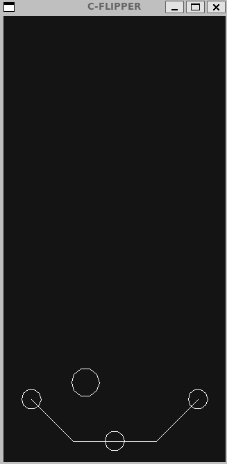

# C Flipper

## ASCII DISPLAY


## SDL DISPLAY


## How to run ?

### SDL Display
```shell
make run
```
### ASCII Command Line Display
```shell
make run-ascii
```

## How to build ?
### SDL Display
```shell
make build
```
### ASCII Command Line Display
```shell
make build-ascii
```

## How to clean ?

```shell
make clean
```
